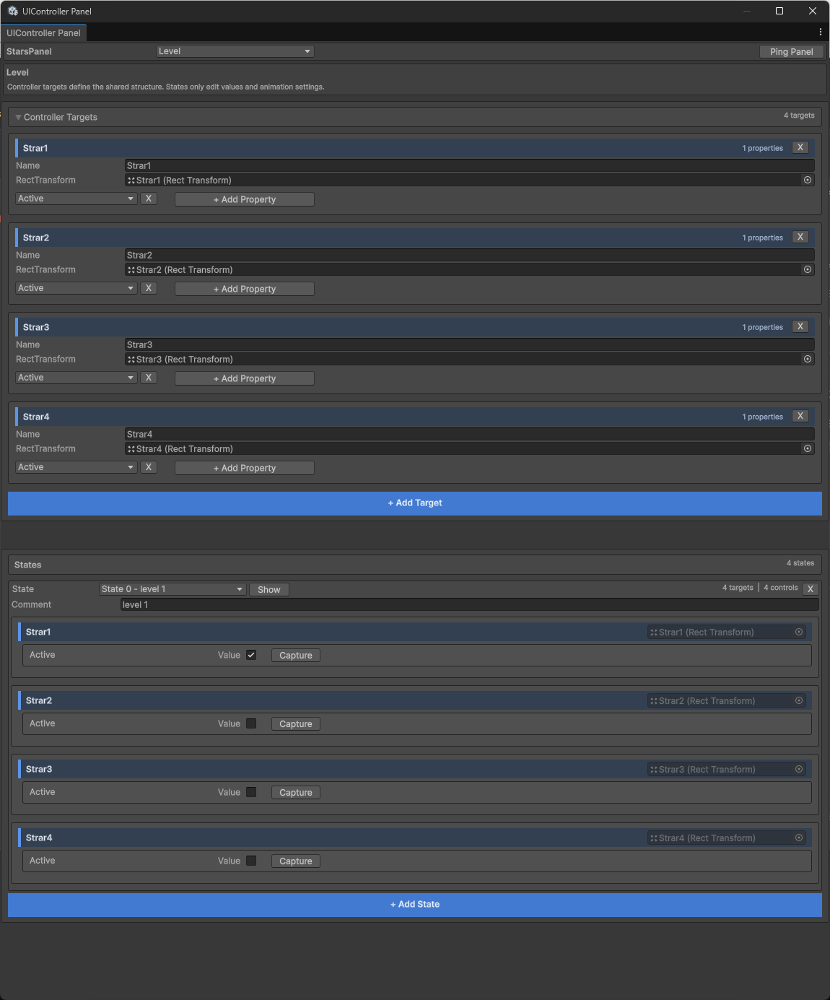
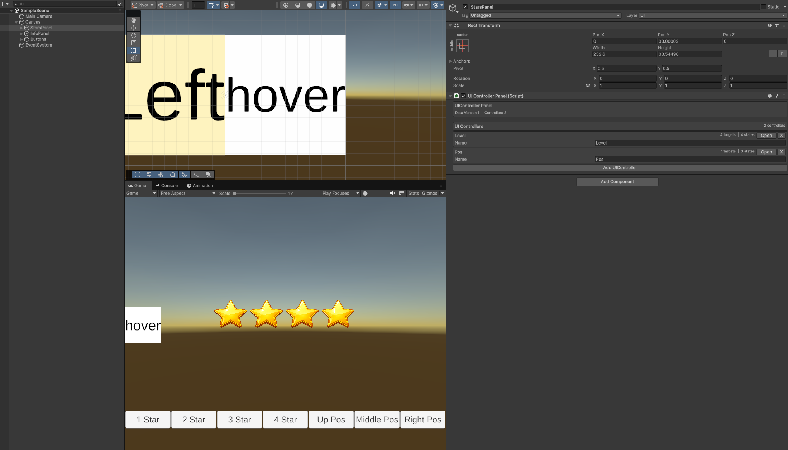

# UIController


**Live Demo:** [https://windsmoon.github.io/UIController/](https://windsmoon.github.io/UIController/)

**在线演示 / GitHub Pages:** [https://windsmoon.github.io/UIController/](https://windsmoon.github.io/UIController/)

UIController is a Unity UI state controller package for building reusable UI state workflows. It lets you define UI controllers, configure shared controller targets, edit multiple states, capture UI values in the editor, and switch states at runtime with one API call.

UIController 是一个用于 Unity UI 状态控制的 Package，适合构建可复用的 UI 状态流程。它可以定义 UI Controller、配置共享的 Controller Target、编辑多个 State、在编辑器中捕获 UI 数值，并在运行时通过一个 API 调用切换状态。

## Language / 语言

| English | 中文 |
| --- | --- |
| [Read English Documentation](#english) | [阅读中文文档](#chinese) |

## Demo Video / 演示视频


## Screenshots / 截图展示

### UIController Panel Inspector



### UIController Panel Window



<a id="english"></a>

## English

### Contents

- [Migration From Older Versions](#migration-from-older-versions)
- [Features](#features)
- [Requirements](#requirements)
- [Installation](#installation)
- [Source Code](#source-code)
- [Current Data Structure](#current-data-structure)
- [Quick Start](#quick-start)
- [Runtime API](#runtime-api)
- [Supported Properties](#supported-properties)
- [Animation Behavior](#animation-behavior)
- [Custom Properties](#custom-properties)
- [Editor Tools](#editor-tools)
- [Roadmap](#roadmap)
- [Repository Layout](#repository-layout)
- [Development](#development)
- [License](#license)

### Migration From Older Versions

This migration upgrades data from versions earlier than v0.4.0 to v0.4.0. v0.4.0 changes the serialized data layout: older versions stored target and property data under each state, while v0.4.0 defines targets and controlled property names once under each controller. Every state now only stores the values for those target/property slots.

Before migration, commit or back up your project data. After migration, check the Console warnings and verify the referenced prefabs, controllers, states, targets, and properties.

#### Single Panel Migration

1. Select a GameObject that has a `UIControllerPanel`.
2. If legacy data is detected, the Inspector shows `Migrate Legacy Data To Controller Targets`.
3. Click the button to migrate that panel to the new controller target structure.
4. If the panel is a prefab instance, prefab instance property modifications are recorded. If it is in a scene, the scene is marked dirty.
5. Migration warnings are written to the Console.

The same migration notice can also appear in `Window > Framework > UI > UIController Panel`. A legacy controller is blocked from the new editor UI until migration is complete.

#### Batch Prefab Migration

Use this when you need to migrate every `UIControllerPanel` inside prefabs under selected folders.

1. Select one or more folders in the Project window.
2. Open `UIController/UIController Legacy Migration`.
3. Confirm the selected folders in the `UIController Migration` window.
4. Click `Migrate Selected Folder Prefabs`.
5. The tool recursively finds prefabs under the selected folders, loads prefab contents, scans all active and inactive `UIControllerPanel` components, and migrates only panels that need migration.
6. Modified prefabs are saved. The final dialog shows scanned count, migrated count, and warning count.

#### Migration Rules

- A controller needs migration only when its `TargetList` is empty and its states still contain legacy target state data.
- Legacy target names are collected into the new `UIControllerTargetData.Name`.
- Legacy target bindings are used to restore the new `UIControllerTargetData.RectTransform`.
- Property names found under each target are collected into the new `PropertyNameList`.
- Each state rebuilds `TargetStateList` and `PropertyList` in the new target/property order.
- Existing legacy property data is reused whenever possible.
- Missing state properties are recreated with default property data. If the target and property are valid, the tool tries to capture the current UI value.
- Missing target bindings, missing property types, duplicated targets, and duplicated properties are reported as warnings.
- Legacy fields are still kept under editor-only compilation and are only used for manual migration.

### Features

- Define named UI controllers and states in the Unity Inspector.
- Define controller-level targets and property lists once, then edit per-state values against that shared structure.
- Capture current UI values into a state from editor tools.
- Preview state changes in the editor.
- Apply states at runtime by controller name and state index.
- Reuse common control effects, such as selected button scaling and highlighted text or image colors.
- Animate supported numeric, vector, and color properties through DOTween.

### Requirements

- The package uses common Unity UI and editor APIs and is intended to work with recent Unity versions.
- Unity UI package: `com.unity.ugui`.
- Text properties require TextMeshPro.
- Runtime animation code expects DOTween.

### Installation

Recommended: download the latest release package from [GitHub Releases](https://github.com/windsmoon/UIController/releases), then import it into your Unity project.

You can also install the tagged package through Unity Package Manager using this Git URL:

```text
https://github.com/windsmoon/UIController.git#v0.5.0
```

DOTween note: if your project already has DOTween installed, and the release package you imported also contains DOTween, delete the duplicated DOTween folder from the imported package to avoid duplicate references or type conflicts.

### Source Code

If you download the repository source code directly from GitHub, the package code is at the repository root:

- `Runtime/`: runtime scripts included in the package.
- `Editor/`: Unity editor scripts included in the package.
- `package.json`: Unity Package Manager manifest.
- `UnityProject~/`: local demo and development Unity project.

Open `UnityProject~` only when you want to inspect or run the demo project. The package source itself is not inside `UnityProject~`; it lives in `Runtime/` and `Editor/` at the repository root.

### Current Data Structure

The current structure keeps controller targets and property names at the controller level. Runtime state application aligns target data and property data by index.

```text
UIControllerPanel
  _dataVersion
  _controllerList
    UIControllerData
      _name
      _targetList
        UIControllerTargetData
          _name                editor only
          _rectTransform
          _propertyNameList
      _stateList
        UIControllerStateData
          _comment             editor only
          _targetStateList
            UIControllerTargetStateData
              _propertyList    SerializeReference UIControllerProperty
```

`UIControllerData.TargetList` defines which targets the controller owns and which properties each target controls. `UIControllerStateData.TargetStateList` no longer stores target names; it stores per-target state values in the same order as `TargetList`. Each `UIControllerTargetStateData.PropertyList` stores property data in the same order as `PropertyNameList`.

When a state is applied, `UIControllerPanel` finds the controller by name, finds the state by index, then applies values using matching target and property indexes. The editor synchronizes all states whenever a target or property is added, removed, or changed.

### Quick Start

1. Add `UIControllerPanel` to a UI object.
2. In the Inspector, click `Add UIController` and set the controller name.
3. Click `Open` on a controller row, or open **Window > Framework > UI > UIController Panel**.
4. In **Controller Targets**, add a target and assign its `RectTransform`.
5. Add the properties that target should control.
6. Add one or more states.
7. Use the **State** dropdown to select the state being edited.
8. Edit property values directly in the state area, or click **Capture** to capture current UI values.
9. Click **Show** to preview a state.
10. Switch states from code:

```csharp
using Windsmoon.UIController;
using UnityEngine;

public class Example : MonoBehaviour
{
    [SerializeField]
    private UIControllerPanel _panel;

    public void ShowLevelTwo()
    {
        _panel.SetControllerState("Level", 1);
    }
}
```

### Runtime API

```csharp
public void SetControllerState(string controllerName, int stateIndex, bool forceNoAnimation = false)
public bool HasController(string controllerName)
public bool HasControllerState(string controllerName, int stateIndex)
public int GetStateCount(string controllerName)
public float GetStateAnimationDuration(string controllerName, int stateIndex)
```

Parameters:

- `controllerName`: The controller name configured in the panel.
- `stateIndex`: The zero-based state index.
- `forceNoAnimation`: Applies values immediately when `true`.

`SetControllerState` throws when controller, state, target state, property state, target `RectTransform`, or matching property index data cannot be found. Use `HasController` and `HasControllerState` when you need to check whether a controller or state exists before switching UI state. Use `GetStateCount` to query how many states a controller has, and `GetStateAnimationDuration` to get the longest animated property duration in a state, including animation delay.

### Supported Properties

| Property | Target | Value | Animation |
| --- | --- | --- | --- |
| `Active` | `GameObject` | `activeSelf` | No |
| `AnchorMin` | `RectTransform` | `anchorMin` | Yes |
| `AnchorMax` | `RectTransform` | `anchorMax` | Yes |
| `AnchoredPosition` | `RectTransform` | `anchoredPosition` | Yes |
| `CanvasGroupAlpha` | `CanvasGroup` | `alpha` | Yes |
| `CanvasGroupInteractable` | `CanvasGroup` | `interactable` | No |
| `ImageColor` | `UnityEngine.UI.Image` | `color` | Yes |
| `ImageFillAmount` | `UnityEngine.UI.Image` | `fillAmount` | Yes |
| `LocalRotation` | `RectTransform` | `localEulerAngles` | Yes |
| `LocalScale` | `RectTransform` | `localScale` | Yes |
| `Pivot` | `RectTransform` | `pivot` | Yes |
| `SizeDelta` | `RectTransform` | `sizeDelta` | Yes |
| `TextForTextMesh` | `TextMeshProUGUI` | `text` | No |
| `TextMeshColor` | `TextMeshProUGUI` | `color` | Yes |
| `TextMeshFontSize` | `TextMeshProUGUI` | `fontSize` | Yes |

The editor uses `UIControllerProperty.IsValid` to decide whether a property can work on the current target. If a selected property does not apply to the assigned target, it is shown as invalid in the controller target list and the state property area.

### Animation Behavior

A property is applied immediately without animation when any of the following is true:

- `UIControllerProperty.CanAnimate == false`
- `NeedAnimate == false`
- `forceNoAnimation == true`
- `AnimationDuration <= 0`

Animated properties can also set an animation delay in seconds. Runtime delay uses DOTween's delayed startup and is included in `GetStateAnimationDuration`.

Runtime animation currently supports `float`, `int`, `Vector2`, `Vector3`, and `Color`.

Editor value editing currently supports `bool`, `string`, `float`, `int`, `Vector2`, `Vector3`, `Vector4`, and `Color`.

Note: the editor can edit `Vector4`, but runtime animation does not create a tween for `Vector4`. A custom `Vector4` property will apply directly at runtime unless runtime tween support is added.

### Custom Properties

Current extension workflow:

1. Create a serializable class that inherits from `UIControllerProperty<T>`.
2. Implement `Name`, `IsValid`, `Capture`, `GetCurrentValue`, and `SetCurrentValue`.
3. If the property supports animation, override `CanAnimate` to return `true`, and make sure `T` is a runtime-supported tween value type.
4. Register the property in `UIControllerPropertyFactory` so it appears in the editor property dropdown.

`GetTargetValue` returns the stored value by default and only needs to be overridden for special value normalization. `GetValueText` is obsolete and is no longer used by the editor workflow.

Example:

```csharp
using System;
using Windsmoon.UIController.Properties;
using UnityEngine;
using UnityEngine.UI;

[Serializable]
public class UIControllerButtonInteractableProperty : UIControllerProperty<bool>
{
    public const string PropertyName = "ButtonInteractable";

    public override string Name => PropertyName;

    public override bool IsValid(RectTransform rectTransform, out string errorMessage)
    {
        if (GetButton(rectTransform) != null)
        {
            errorMessage = null;
            return true;
        }

        errorMessage = "Target has no Button component.";
        return false;
    }

    public override void Capture(RectTransform rectTransform)
    {
        Button button = GetButton(rectTransform);
        if (button != null)
        {
            _value = button.interactable;
        }
    }

    public override bool GetCurrentValue(RectTransform rectTransform)
    {
        Button button = GetButton(rectTransform);
        return button != null ? button.interactable : _value;
    }

    public override void SetCurrentValue(RectTransform rectTransform, bool value)
    {
        Button button = GetButton(rectTransform);
        if (button != null)
        {
            button.interactable = value;
        }
    }

    private static Button GetButton(RectTransform rectTransform)
    {
        return rectTransform != null ? rectTransform.GetComponent<Button>() : null;
    }
}
```

Then register it in `UIControllerPropertyFactory`:

```csharp
new UIControllerPropertyDefinition(
    UIControllerButtonInteractableProperty.PropertyName,
    () => new UIControllerButtonInteractableProperty()),
```

### Editor Tools

- Inspector integration for `UIControllerPanel`.
- Dedicated editor window: **Window > Framework > UI > UIController Panel**.
- Batch migration window: **UIController/UIController Legacy Migration**.
- Controller, state, target, and property dropdowns.
- Collapsible **Controller Targets** section.
- One visible state at a time, selected through a state dropdown.
- Target properties laid out in multiple columns based on available width.
- Direct state property value editing without an extra Edit button.
- Capture and preview state values.
- Configure animation ease type, duration, and delay for animated properties.

### Roadmap

- Improve editor experience.
- Better and more demos.
- More built-in property support.
- Custom property registration without modifying package source code.
- Fallback animation methods when DOTween is not available.
- More supported animation value types.

### Repository Layout

```text
Runtime/          Runtime package code
Editor/           Unity editor tooling
Samples~/         Sample package content
Documentation~/   Package documentation
Tests~/           Hidden test folder
UnityProject~/    Local development Unity project
```

`UnityProject~` is only for local development. The trailing `~` keeps Unity Package Manager from importing it as package content.

### Development

The local Unity project references the package from the repository root:

```json
"com.windsmoon.uicontroller": "file:../../"
```

Open `UnityProject~` in Unity when you want to test the package locally.

### License

MIT. See [LICENSE](LICENSE).

<a id="chinese"></a>

## 中文

### 目录

- [从旧版本迁移数据](#从旧版本迁移数据)
- [功能特性](#功能特性)
- [环境要求](#环境要求)
- [安装方式](#安装方式)
- [源码位置](#源码位置)
- [当前数据结构](#当前数据结构)
- [快速开始](#快速开始)
- [运行时 API](#运行时-api)
- [支持的属性](#支持的属性)
- [动画行为](#动画行为)
- [自定义属性](#自定义属性)
- [编辑器工具](#编辑器工具)
- [后续计划](#后续计划)
- [仓库结构](#仓库结构)
- [开发说明](#开发说明)
- [许可证](#许可证)

### 从旧版本迁移数据

这里的迁移指从 v0.4.0 以下版本迁移到 v0.4.0。v0.4.0 调整了序列化结构：旧版本把 target 和 property 数据存放在每个 state 下面；v0.4.0 把 target 和 property 名称提升到 controller 下面统一定义，每个 state 只保存对应 target/property 槽位的状态值。

迁移前建议先提交或备份项目数据。迁移完成后，如果 Console 出现 warning，需要逐条检查对应 prefab、controller、state、target 或 property 是否符合预期。

#### 单个 Panel 迁移

1. 在 Unity 中选中带有 `UIControllerPanel` 的对象。
2. 如果 Inspector 检测到旧数据，会显示 `Migrate Legacy Data To Controller Targets` 按钮。
3. 点击按钮后，工具会把这个 panel 的旧数据迁移到新的 controller target 结构。
4. 如果该 panel 是 prefab instance，迁移会记录 prefab instance 的属性修改；如果在场景中，会标记场景 dirty。
5. 迁移产生的 warning 会输出到 Console。

打开 **Window > Framework > UI > UIController Panel** 后，如果当前 panel 仍是旧结构，窗口里也会显示同名迁移按钮。迁移完成前，旧结构 controller 不会进入新版编辑界面。

#### 批量迁移 prefab

用于一次处理选中文件夹下所有 prefab 中的 `UIControllerPanel`。

1. 在 Project 窗口选中一个或多个文件夹。
2. 打开菜单 **UIController/UIController Legacy Migration**。
3. 在弹出的 `UIController Migration` 窗口中确认选中的文件夹。
4. 点击 `Migrate Selected Folder Prefabs`。
5. 工具会递归查找选中文件夹下的所有 prefab，加载 prefab contents，遍历其中所有 active 和 inactive 的 `UIControllerPanel`，只迁移确实需要迁移的数据。
6. 有修改的 prefab 会被保存，最终会弹出扫描数量、迁移数量和 warning 数量。

#### 迁移规则

- 只有 controller 的 `TargetList` 为空，且 state 下仍有旧 target state 数据时，才会被判定为需要迁移。
- 旧版 target 名称会被收集为新版 `UIControllerTargetData.Name`。
- 旧版 target binding 会用于还原新版 `UIControllerTargetData.RectTransform`。
- 每个 target 下出现过的 property 名称会被收集为新版 `PropertyNameList`。
- 每个 state 会按新版 target/property 顺序重建 `TargetStateList` 和 `PropertyList`。
- 旧 state 中已有的 property 数据会尽量复用。
- 某个 state 缺失的 property 会创建默认 property；如果 target 和 property 有效，会尝试从当前 UI 上 capture 默认值。
- 找不到 target binding、property 类型缺失、重复 target/property 等情况会写入 warning。
- 旧数据字段仍保留在 editor 条件编译下，仅用于手动迁移。

### 功能特性

- 在 Unity Inspector 中配置命名 UI Controller 和多个 State。
- 在 controller 层统一定义 target 和 property 列表，再在每个 state 下编辑对应值。
- 在编辑器中一键捕获当前 UI 值到状态配置。
- 支持编辑器内预览状态切换。
- 运行时通过 controller 名称和 state 索引切换 UI。
- 复用常见控件效果，例如按钮选中缩放、文字高亮、图片变色等状态表现。
- 对数值、向量、颜色类属性支持 DOTween 动画。

### 环境要求

- 本包使用常见 Unity UI 和编辑器 API，面向近期 Unity 版本。
- Unity UI 包：`com.unity.ugui`。
- Text 相关属性依赖 TextMeshPro。
- 运行时动画代码依赖 DOTween。

### 安装方式

推荐从 [GitHub Releases](https://github.com/windsmoon/UIController/releases) 下载最新 release 包，然后导入 Unity 工程。

也可以在 Unity Package Manager 中通过 Git URL 安装已打 tag 的版本：

```text
https://github.com/windsmoon/UIController.git#v0.5.0
```

DOTween 引用提示：如果你的项目里已经安装 DOTween，而导入的 release 包里也带了 DOTween，可以把包里重复的 DOTween 文件夹删除，避免重复引用或类型冲突。

### 源码位置

如果直接从 GitHub 下载源码工程，package 代码在仓库根目录：

- `Runtime/`：会进入包的运行时代码。
- `Editor/`：会进入包的 Unity 编辑器代码。
- `package.json`：Unity Package Manager 的包清单。
- `UnityProject~/`：本地演示和开发用 Unity 工程。

只有需要查看或运行演示工程时才打开 `UnityProject~`。真正的 package 源码不在 `UnityProject~` 里面，而是在仓库根目录的 `Runtime/` 和 `Editor/`。

### 当前数据结构

当前结构把 controller targets 和 property names 保存在 controller 层。运行时状态切换时，target 数据和 property 数据都按 index 对齐。

```text
UIControllerPanel
  _dataVersion
  _controllerList
    UIControllerData
      _name
      _targetList
        UIControllerTargetData
          _name                editor only
          _rectTransform
          _propertyNameList
      _stateList
        UIControllerStateData
          _comment             editor only
          _targetStateList
            UIControllerTargetStateData
              _propertyList    SerializeReference UIControllerProperty
```

`UIControllerData.TargetList` 定义 controller 控制哪些 target，以及每个 target 控制哪些 property。`UIControllerStateData.TargetStateList` 不再保存 target 名称，而是按 `TargetList` 的顺序保存每个 target 的状态值。每个 `UIControllerTargetStateData.PropertyList` 也按 `PropertyNameList` 的顺序保存 property 数据。

切换状态时，`UIControllerPanel` 会按 controller name 找到 controller，按 state index 找到 state，然后用 target index 和 property index 对齐应用数据。编辑器在增删或修改 target/property 时，会同步所有 state 的结构。

### 快速开始

1. 在 UI 对象上添加 `UIControllerPanel`。
2. 在 Inspector 中点击 `Add UIController` 创建 controller，并填写名称。
3. 点击 controller 行上的 `Open`，或通过 **Window > Framework > UI > UIController Panel** 打开编辑窗口。
4. 在 **Controller Targets** 中添加 target，并指定 `RectTransform`。
5. 给 target 添加需要控制的 property。
6. 添加一个或多个 state。
7. 通过 **State** 下拉框选择当前正在编辑的 state。
8. 在 state 区域直接编辑 property 值，或点击 **Capture** 捕获当前 UI 值。
9. 需要预览时点击 **Show**。
10. 在代码中切换状态：

```csharp
using Windsmoon.UIController;
using UnityEngine;

public class Example : MonoBehaviour
{
    [SerializeField]
    private UIControllerPanel _panel;

    public void ShowLevelTwo()
    {
        _panel.SetControllerState("Level", 1);
    }
}
```

### 运行时 API

```csharp
public void SetControllerState(string controllerName, int stateIndex, bool forceNoAnimation = false)
public bool HasController(string controllerName)
public bool HasControllerState(string controllerName, int stateIndex)
public int GetStateCount(string controllerName)
public float GetStateAnimationDuration(string controllerName, int stateIndex)
```

参数说明：

- `controllerName`：在 panel 中配置的 UI Controller 名称。
- `stateIndex`：从 `0` 开始的 state 索引。
- `forceNoAnimation`：为 `true` 时立即应用目标值，不播放动画。

`SetControllerState` 在找不到 controller、state、target state、property state、target `RectTransform`，或 property index 对应不上时会抛出异常。需要在切换 UI 状态前判断 controller 或 state 是否存在时，可以使用 `HasController` 和 `HasControllerState`。需要查询 controller 有多少个 state 时，可以使用 `GetStateCount`；需要获取某个 state 的最长动画时长时，可以使用 `GetStateAnimationDuration`，返回值会包含动画延迟。

### 支持的属性

| 属性 | 目标组件 | 控制值 | 支持动画 |
| --- | --- | --- | --- |
| `Active` | `GameObject` | `activeSelf` | 否 |
| `AnchorMin` | `RectTransform` | `anchorMin` | 是 |
| `AnchorMax` | `RectTransform` | `anchorMax` | 是 |
| `AnchoredPosition` | `RectTransform` | `anchoredPosition` | 是 |
| `CanvasGroupAlpha` | `CanvasGroup` | `alpha` | 是 |
| `CanvasGroupInteractable` | `CanvasGroup` | `interactable` | 否 |
| `ImageColor` | `UnityEngine.UI.Image` | `color` | 是 |
| `ImageFillAmount` | `UnityEngine.UI.Image` | `fillAmount` | 是 |
| `LocalRotation` | `RectTransform` | `localEulerAngles` | 是 |
| `LocalScale` | `RectTransform` | `localScale` | 是 |
| `Pivot` | `RectTransform` | `pivot` | 是 |
| `SizeDelta` | `RectTransform` | `sizeDelta` | 是 |
| `TextForTextMesh` | `TextMeshProUGUI` | `text` | 否 |
| `TextMeshColor` | `TextMeshProUGUI` | `color` | 是 |
| `TextMeshFontSize` | `TextMeshProUGUI` | `fontSize` | 是 |

编辑器会用 `UIControllerProperty.IsValid` 判断 property 是否能作用于当前 target。如果选择的 property 对指定 target 不生效，它会在 Controller Targets 和 state property 区域中显示为无效。

### 动画行为

以下任一条件成立时，property 会直接应用目标值，不播放动画：

- `UIControllerProperty.CanAnimate == false`
- `NeedAnimate == false`
- `forceNoAnimation == true`
- `AnimationDuration <= 0`

可动画属性还可以配置以秒为单位的动画延迟。运行时延迟使用 DOTween 的延迟启动实现，并会计入 `GetStateAnimationDuration` 的结果。

当前运行时动画支持 `float`、`int`、`Vector2`、`Vector3` 和 `Color`。

编辑器当前可直接编辑的 property value 类型包括 `bool`、`string`、`float`、`int`、`Vector2`、`Vector3`、`Vector4` 和 `Color`。

注意：编辑器能编辑 `Vector4`，但当前运行时动画逻辑没有为 `Vector4` 创建 tween。如果自定义 `Vector4` property，运行时会直接应用目标值，除非后续补充对应 tween 支持。

### 自定义属性

当前版本的扩展方式：

1. 新建一个可序列化类，继承 `UIControllerProperty<T>`。
2. 实现 `Name`、`IsValid`、`Capture`、`GetCurrentValue`、`SetCurrentValue`。
3. 如果支持动画，重写 `CanAnimate` 返回 `true`，并确保 `T` 是当前运行时支持 tween 的类型。
4. 在 `UIControllerPropertyFactory` 中注册这个属性，让它出现在编辑器属性下拉菜单里。

`GetTargetValue` 默认会返回已保存的属性值，只有需要特殊值归一化时才需要重写。`GetValueText` 已经过时，当前编辑器工作流不再使用它。

示例：

```csharp
using System;
using Windsmoon.UIController.Properties;
using UnityEngine;
using UnityEngine.UI;

[Serializable]
public class UIControllerButtonInteractableProperty : UIControllerProperty<bool>
{
    public const string PropertyName = "ButtonInteractable";

    public override string Name => PropertyName;

    public override bool IsValid(RectTransform rectTransform, out string errorMessage)
    {
        if (GetButton(rectTransform) != null)
        {
            errorMessage = null;
            return true;
        }

        errorMessage = "Target has no Button component.";
        return false;
    }

    public override void Capture(RectTransform rectTransform)
    {
        Button button = GetButton(rectTransform);
        if (button != null)
        {
            _value = button.interactable;
        }
    }

    public override bool GetCurrentValue(RectTransform rectTransform)
    {
        Button button = GetButton(rectTransform);
        return button != null ? button.interactable : _value;
    }

    public override void SetCurrentValue(RectTransform rectTransform, bool value)
    {
        Button button = GetButton(rectTransform);
        if (button != null)
        {
            button.interactable = value;
        }
    }

    private static Button GetButton(RectTransform rectTransform)
    {
        return rectTransform != null ? rectTransform.GetComponent<Button>() : null;
    }
}
```

然后在 `UIControllerPropertyFactory` 中注册：

```csharp
new UIControllerPropertyDefinition(
    UIControllerButtonInteractableProperty.PropertyName,
    () => new UIControllerButtonInteractableProperty()),
```

### 编辑器工具

- `UIControllerPanel` 的 Inspector 集成。
- 独立编辑窗口：**Window > Framework > UI > UIController Panel**。
- 批量迁移窗口：**UIController/UIController Legacy Migration**。
- Controller、State、Target、Property 下拉选择。
- **Controller Targets** 区域可以整体收起。
- State 区域一次只显示一个 state，并通过下拉框选择。
- Target property 会根据窗口宽度自动多列布局。
- State 中 property 值直接暴露编辑，不需要额外点击 Edit 按钮。
- 支持捕获和预览状态值。
- 支持为可动画属性配置动画类型、动画时长和动画延迟。

### 后续计划

- 更好的编辑器体验。
- 更好更多的 demo。
- 更多内置属性支持。
- 自定义属性扩展无需修改包源码。
- 无 DOTween 时回退到其他动画方法。
- 更多可支持的动画值类型。

### 仓库结构

```text
Runtime/          运行时代码
Editor/           Unity 编辑器工具
Samples~/         示例内容
Documentation~/   包文档
Tests~/           隐藏测试目录
UnityProject~/    本地开发用 Unity 工程
```

`UnityProject~` 只用于本地开发。目录名末尾的 `~` 会让 Unity Package Manager 忽略它，避免开发工程被当作包内容导入。

### 开发说明

本地 Unity 工程通过仓库根目录引用当前包：

```json
"com.windsmoon.uicontroller": "file:../../"
```

需要本地调试包时，打开 `UnityProject~` 工程即可。

### 许可证

MIT。详见 [LICENSE](LICENSE)。
